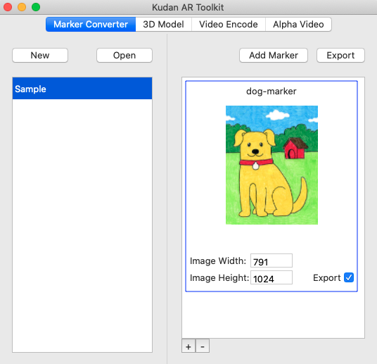
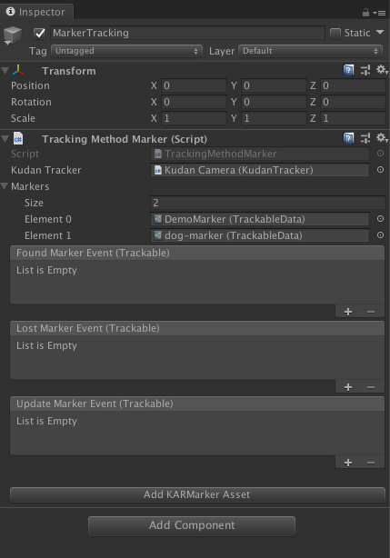
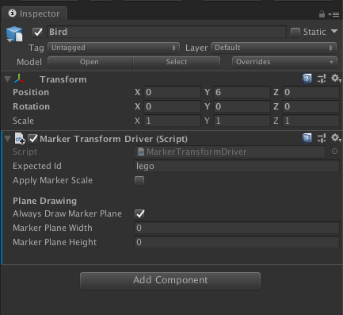

# Unity-Multiple-Marker-Sample

A demonstration of implementing multiple markers using Unity and KudanAR SDK (Compatible with Unity 2018.x)

## Instructions

- Download the Kudan Unity Plugin from [the XLsoft Kudan Download Page](https://www.xlsoft.com/en/products/kudan/download.html?utm_source=external&utm_medium=github&utm_campaign=xlsoft_Unity-Multiple-Marker-Sample).
- Open the Unity Project and go to **Assets -> Import Package -> Custom Package**
- Add `KudanARUnity.unitypackage`

### Setting up the Application Identifier

Make sure your Application Identifier is correct for the API Key you’re using. You can find your project’s Application Identifier by clicking the Set App ID button on the Kudan Trackerscript, or by going to **Edit -> Project Settings -> Player** and opening Other Settings in the iOS tab.

Your Application ID be either:

- The ID you entered when generating your free key on the Kudan website, in the format “com.companyName.productName”.
- If you are using the Development License Key, com.xlsoft.kudanar.

You should set the matching API key from **Scene -> Kudan Bundle - With UI -> Kudan Camera** and opening the Inspector

To see if your API Key is valid for the Application ID you put in, run the app in Play Mode. A message will print out in the console telling you whether or not your API Key is valid.

## Setting Up New Markers

You will be able to create new markers and link them to 3D objects in Unity utilizing the KudanAR Toolkit.

    

After creating a KARMarker Asset, you will need to add the asset as a Marker in **Kudan Camera -> Marker Tracking**

    

Additionally, in **Driver -> Marker**, you will need to add `Marker Based Driver` Script. You will need to insert the expected ID to link the target to the desired marker of choice.

    

For additional help, visit the [XLsoft Kudan Developer Hub](https://www.xlsoft.com/en/products/kudan/download.html?utm_source=external&utm_medium=github&utm_campaign=xlsoft_Unity-Multiple-Marker-Sample).

### Camera Usage Description

Add a camera usage description in the appropriate field. Since Kudan uses the camera, the app will crash on iOS 10+ if an app does not contain a usage description. The message can be anything you like, as long as it isn’t empty.

### Deploy the Application

- Build and run the Unity Project on specified device

## Build the Xcode project

Build the app by going to File -> Build Settings, selecting iOS and clicking Build. Unity will build the selected scenes and produce an XCode project in the selected folder.

- Disable Bitcode, go to the Build Settings tab of your workspace, scroll down to Build Options, and set Enable Bitcode to No.
- Run the XCode project

For any additional questions or concerns, visit the [XLsoft Kudan Developer Hub](https://www.xlsoft.com/en/products/kudan/download.html?utm_source=external&utm_medium=github&utm_campaign=xlsoft_Unity-Multiple-Marker-Sample).

For any inquires, please contact [XLsoft](https://www.xlsoft.com/en/services/xl_form.html?option2=Kudan&utm_source=external&utm_medium=github&utm_campaign=xlsoft_Unity-Multiple-Marker-Sample).
